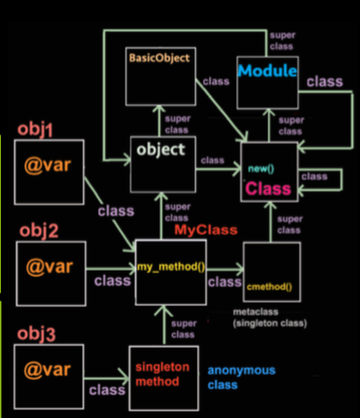
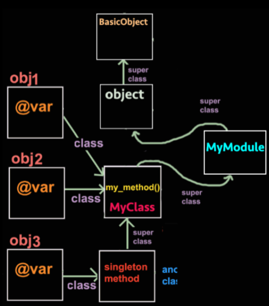
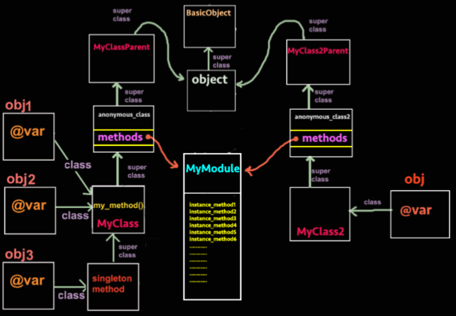

# Ruby
- Ruby is a scripting language, which means the statement can be executed individually.
  - irb: Command line tools for executing
  - ruby program: A file is named with extension ".rb"
- Everything is an Object
  - Any value is an object can invoke method.
- require_relative : load the class from current folder(). If the file you are loading is relative to the directory as the file requiring another file, you can use require_relative
- require: load external files, mostly for library file.

## Comment
- \# is for one line comment
- =begin .. =end to comment block

## Executable(shebang)
- \#!/usr/bin/ruby

## Data
- Data Types:
  - Numeric : Integer, Float, rational, complex
  - Range
  - String

### Numeric
- Integer
  - Definition
    - Decimal: 123, 0d123
    - Octal: 0123, 0o123
    - Hex: 0x7B
    - Binary: 0b10011
    - **Undersocre will be ignored**
  - Method:
    - even?
    - odd?
    - zero?
    - abs
    - chr: convert to character
    - size: number of bytes
    - next == succ: next integer
    - times{|x| loop} / times do |x| end
    - upto(val){|x| } / downto(val){|x| }
    - to_s(base): convert to String

### Range
- Definition:
  - Range is a pair of Start value and End value
  - ... exclusive operator
  - .. inclusive opeartor
- New
  - Range.new(start, end, exclusive = false)
- Method:
  - begin, end
  - cover?: covered in the range
  - include?: element in the range
  - exclude_end?
  - first(n) / last(n)
  - size is for Integers
    - (2.5..3.5).size = 2
  - count
  - step(stepDis) walk step
  - max
  - min
### String
- Create String:
  - s1 = "iloveyou"
  - s2 = String.new(str)
  - \# here document
    - x = <<END_MARK
      ....
      END_MARK

- Operation
  - Append
    - \+ / <<: Append
    - *: times to repeat
  - Spaceship <=>
    - Using ASCII to do the substract
  - Value Of
    - String[Range]
    - String.length
  - '' and  ""
    - string will be interpreted in ""
  - \#{Expression} , expression will be executed
  - %q for ''
  - %Q / nothing for ""
  - slice(Range)

## Symbols
- Symbol is the string of the variable name
- Symbols.all_symbols
- :name = 'name'
## Container
### Array
- Create Array
  - Array.new
  - Array[5] = 4 => [nil, nil, nil, nil, nil, 4]
  - Array[Range] = Array
  - Array[Range] = val : shrink length
  - Array[n] = Array : Nested
  - Array[n] = val
  - Array.new(4, val) => [val, val, val, val]
- value of
  - \[n] /\[](n)
- Methond
  - intersect: &
  - Union : |
  - \* num : repeat
  - \* char : separator
  - \- 补集
  - Append: + / <<
  - XOR : A1 | A2 - A1 & A2
  - first(n) / last(n)
  - length == size
  - push(val) / pop(n) // from right
  - %w{} => char Array
  - combination(n).to_a
  - permutation(n).to_a
  - flatten(level)
  - reverse
  - rotate: left rotate
  - shift / unshift: from left
  - slice(Range)
  - shuffle
  - sort
  - uniq: remove duplicate
  - join(separator) == *(separator)
  - String.split -> array
  - map{|x| } value after map
  - each{|x| } same value
  - select{|x| condition}
  - empty?
  - eql?
  - insert(n, val)
  - each/ each_index / each_with_index |item, index|
  - inject(intial, :operator) / inject{|result, val| block}
### Hash
- Create Hash
  - Hash.new(val)
  - Hash.default // val is default
 Value
  - a = {"key" => val}
- Value of
  - if does not have key it will return default value
  - keys: all keys
  - size == length
  - value_at(key) => array
  - value? == has_value?
  - \== same key with same value
  - clear
  - delete(key){|key|, not found}, return value
  - each{|key, value|}
  - each_key
  - each_value
  - empty?
  - has_key? == include?
  - invert: key <=> value
  - key(val): get the key of the val
  - delete_if(|key, value| condition)
  - keep_if(|key, value| condition)
  - merge(h2)
  - replace(h2)
  - h.to_a
  - h.shift
## Method
```ruby
def my_method (params...)
  #code
  return value
```
- can return values as an array
- last evaluated expression will be return value
- Integer pass value, others path reference
- Arguments
  - Argument can reference other parameter
  - Argument can use splat to get multiple parameter at once.
  - Pass hash: it should be after the normal arguments and before splat
  - calling arguments should use the same keyword, keword must be after normal
  - **splat used to get Hash
  - \* get the rest of value
  - nested parameters
- Method in method
  - Outer method called than the inner method will define
- Aliasing method: alias new old
- Dynamiclly invoke method
  - send(method name, data)
- redefine
  - builtin methond
  ``` ruby
  def puts str
    print str + '\n'
  end
  ```
  - operator method
  ``` ruby
  class Integer
    alias original_times *
    def *(x)
      original_times(x) + 8
    end
  end
  ```


## class
``` ruby
class ClassName
  def initialize(var)
    @var = var
  end
end
```
- save state in the instance variable
- instance variable is a private variable. using getter and setter method instead
- setter:
  ``` ruby
    def var = (x)
      @var = x
    end

    obj.var = (5)
    obj.var = 5
  ```
  - the return value of the setter is the assinemnt value not the method return value
- using attr_reader & attr_writer instead of the get and set, or attr_accessor for both

- Method
  - Instance Method: normal methods are instance method
  - Singleton Method: only can be used for specific instance.
    - Class Method: A Special Singleton method only for class,
      ``` ruby
      class << self
        def method_name
          ...
        end
      end
      ```

      ``` ruby
      class MyClass
        def self.class_Method
          ...
        end
      end
      ```
- SubClass
  ``` ruby
  class MySubClass < MyClass
    def sub_method
      ...
    end
  end
  ```
  - super is used to invoke the same name method in the super class
  - If subclass does not need initial, then it will use the parent one.
- Class
  - class is an object
  - hold all instance methods
  - hold all class instance variable
  - hold all constants
  - class method belongs to metaclass(singleton class)
  - singleton method belongs to a anonymous class
  - set instance variable:
    - instance_variable_set(:@var2, "newvar")
  - Different object with same type can have different method (singleton method), different instance variable(with obj.instance_variable_set)
  - Class.new() do end define new class
  - Struct.new() do end define a class only with attributes， then we can use open class to add method

 ## Module
  - Module is almost same with Class without new() without parent
  - Module is the superclass of the Class
  - Module is used to organize constants, provide collection of methods
  - Module method
    - just like class method
    - class can include module then object can call the instance method in module. module is called mixin.





  - MyModule belong to two superclass chains is a problem, ruby use prepend to solve.
  - include & prepend
    - prepend add previous
    - include add after
  - extend
    - obj.extend Module(singleton method)
    - class C; extend Module (class method)
  - include & require
    - include become inheritance
    - require they are equal
## Constant
  - class names are constants
  - Anything start with uppercase letter are constants
  - constant can be changed but get warning
  - Outer constant can be access from inner
  - Inner constant can be access from outer using::
  - using .constants can get all constants in the scope
  - using .nesting can get a list of Module at the point
  - Using :: scope will be the receiver
## Expression
### Assignment
- chain: a= (b= 2*3) + 4
- parallel:
  - \, for separate
  - \* for expand
- nest
  - () for one unit

### Control Structures
- If, elsif, else, end/ if then
- unless: if not
- case: like switch
  - case var, when.. then.. else ..end
  - **===**
    - Range: cover?
    - Object: ===
    - RegExp: match
    - Module: an instance of
- while / util
  - expresssion while condition
- loop(while(true))
- next if / break if
- for i in Range / range
- iterator

## Block and Iterator
- method using yield to call block with parameters
- {} and do end difference
  - {} has higher precedence, bind tightly with the previous
  - do end
- Return value of the iterator:
  - [1,2,3,4,5].find{|x| x * x == x + x}
  - select
  - collect => map
- Scope:
  - while/util/for : no new scope has been created. can be visited outside
  - loop/ block: new scope has been created.
    - if outside has the same symbol variable, the variable in block will use that one
    - or add ';' at the block parameter

## Regular Expression(regexp, regex)
- using // to close the string pattern
- i for insensitive
- | for or OR []
- ^ for start
- $ for end
- {min, max}
- [^] for neg
- \w,\d,\s   =====oppo==== \W, \D, \S
- \w contains the digits and letters
- str.scan(pattern)
- /pattern/ =~ string return nil or positon
- !~ dose not match
- replace(pattern, replace value)
  - sub return first match
  - gsub return all match
- match(str, pattern)
- m = pattern.match(str)
- m.pre_match -> m[0] -> m.post_match
- .* => greedy
- .*? => lazy
- Group () \1\2\3 represent the content of the group
  - (?<name>) name is the name of the group can also be used as local variable

## I/O
- Kernel
- Classes:
  - IO
  - File
  - BasicSocket
- putc : print char, for string it will return first character
- gets :return next line
- readline == gets
- readlines return array of lines
- File.new(filename, mode)
- file.close
  - r: read only
  - r+: read and write
  - w: write only
  - w+: clear old
  - a: append and write
  - a+ append read and write
- File.open(filename, mode) do |file| <= file object
  - file.each_line{|line| }
- ARGV: store the arguments getting from the command line
- ARGF: access each file in the command line
- CSV : comma sperate  value
